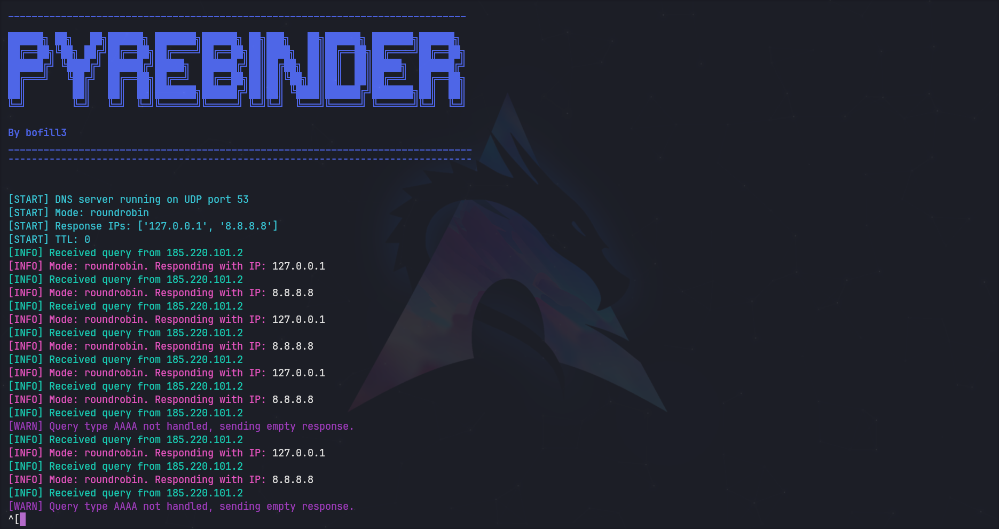

# PyRebinder



## Overview

PyRebinder is a customizable DNS server tool designed for DNS rebinding pentesting. It allows you to configure essential parameters such as TTL, port, and response mode, making it a versatile asset for security testing. The tool supports multiple response modes:

- **Random Mode:** Returns a random IP from the provided list.
- **Round Robin Mode:** Cycles through the provided IP addresses sequentially.
- **Count Mode:** Returns the first IP for a specified number of requests (using the `--count-requests` parameter), then consistently returns the second IP. This mode requires exactly two IP addresses.

## Features

- **Customizable TTL:** Set the Time-To-Live for DNS responses. (Default: 0)
- **Configurable Port:** By default, the tool listens on port 53.
- **Multiple Response Modes:** Choose between random, roundrobin, or count-based responses.
- **Enhanced Logging:** Colored, aesthetic log output for improved readability.

## Requirements

- Python 3.x
- [dnslib](https://pypi.org/project/dnslib/)

Install the required package with:

```bash
pip install dnslib
```

## Usage

Run the tool with your desired configuration. Below are some examples:

- **Random Mode:**

  ```bash
  ./pyrebinder.py --ips "8.8.8.8,127.0.0.1" --port 53 --ttl 0 --mode random
  ```

- **Round Robin Mode:**

  ```bash
  ./pyrebinder.py --ips "8.8.8.8,127.0.0.1" --port 53 --ttl 0 --mode roundrobin
  ```

- **Count Mode (requires exactly 2 IPs and the `--count-requests` parameter):**

  ```bash
  ./pyrebinder.py --ips "IP1,IP2" --port 53 --ttl 0 --mode count --count-requests 5
  ```

## AWS DNS Setup

When deploying on AWS, ensure that no system service interferes with PyRebinder's operation on port 53. Use the following commands:

- **Stop the DNS resolver service:**

  ```bash
  sudo systemctl stop systemd-resolved
  ```

- **Verify that port 53 is available:**

  ```bash
  sudo lsof -i :53
  ```

## License


## Disclaimer

This tool is intended solely for educational and authorized penetration testing purposes. Unauthorized use against systems without explicit permission is illegal and unethical.
